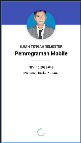
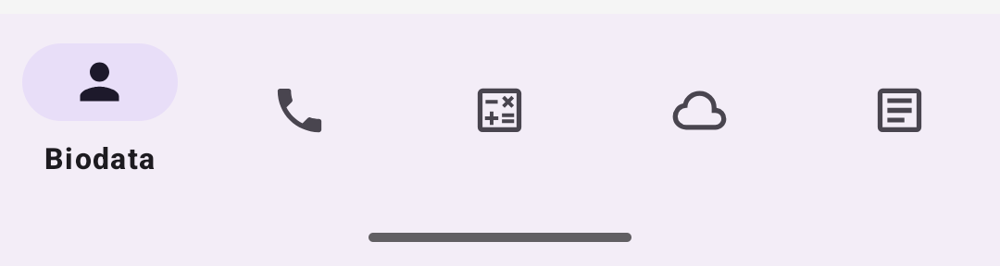
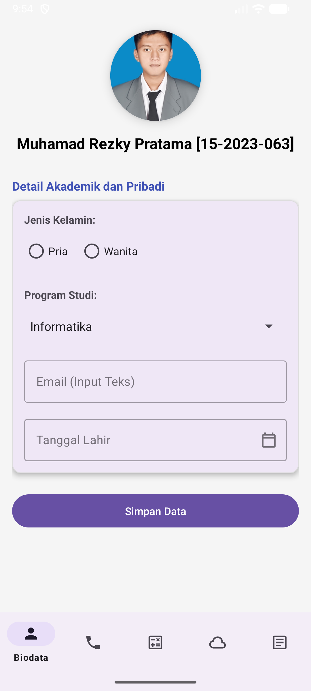
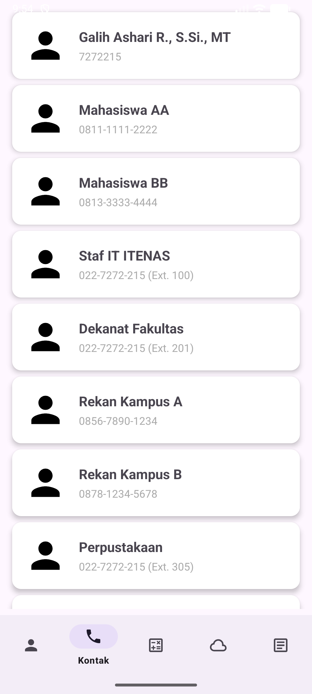
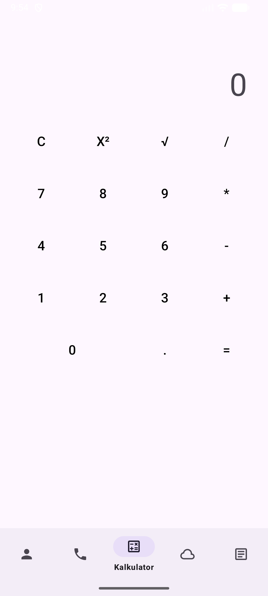
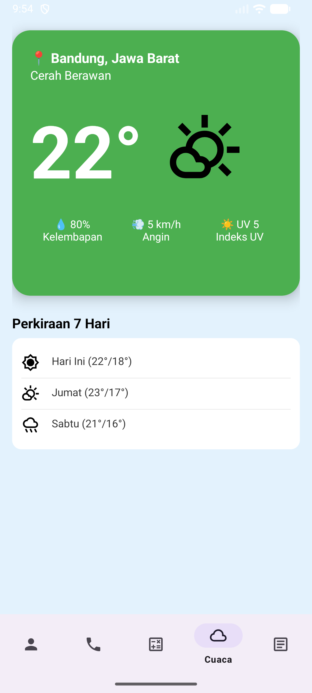
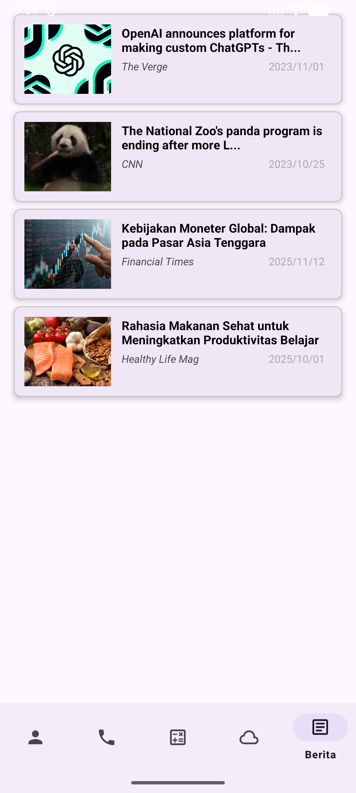

# Proyek ini adalah implementasi aplikasi mobile berbasis Kotlin dan Android View untuk memenuhi Ujian Tengah Semester mata kuliah Pemrograman Mobile Semester Ganjil 2024/2025. 
# Aplikasi ini menerapkan berbagai jenis layout dan widget.

## 1. Fondasi Aplikasi

## Splash Screen : Halaman awal aplikasi yang menampilkan Judul Mata Kuliah, Ujian Tengah Semester, Foto Mahasiswa, NIM, dan Nama. Transisi otomatis ke Dashboard setelah 5 detik.

## Dashboard & Navigasi : Menggunakan Bottom Navigation Bar untuk navigasi ke 5 menu utama. Semua menu diimplementasikan menggunakan konsep Fragment.

## 2. Implementasi Menu (Fragment)
## A. Halaman Biodata

## Tujuan: Menampilkan profil dan widget input data.
## Desain: Menggunakan CardView dan ConstraintLayout dengan image foto profile di bagian atas.
## Widget Input: Tersedia Radio Button (Jenis Kelamin), Spinner (Program Studi), Input Teks (Email), dan Calendar Picker (Tanggal Lahir). *

## B. Halaman Kontak

## Tujuan: Menampilkan daftar telepon statis.
## Implementasi: Menggunakan RecyclerView untuk menampilkan 15 kontak telepon statis.
## Desain: Setiap item terdiri dari circle image dan teks (Nama/Phone) di dalam CardView. *

## C. Halaman Kalkulator

## Tujuan: Menyediakan fungsi kalkulator sederhana.
## Fungsionalitas: Sudah dapat melakukan perhitungan dasar (tambah, kurang, kali, bagi) serta operasi khusus (kuadrat x² dan akar kuadrat √). *

## D. Halaman Cuaca

## Tujuan: Menampilkan informasi cuaca statis dengan desain menarik.
## Implementasi: Menggunakan CardView dan LinearLayout untuk menampilkan Suhu (22°), Kelembapan (80%), Angin (5 km/h), dan perkiraan 7 hari.
## Desain: Dilengkapi gambar kondisi cuaca yang cakep. *

## E. Halaman Berita

## Tujuan: Menampilkan feed berita statis.
## Implementasi: Menggunakan RecyclerView dengan pola tampilan berulang yang menampilkan thumbnail, Judul, Sumber, dan Tanggal.
